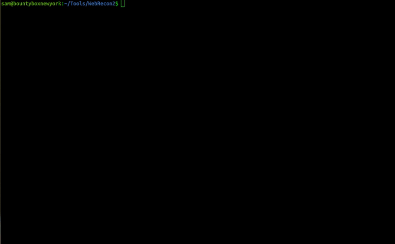

# WebRecon2

A re-write of WebRecon. It's faster and prettier.

Shoutout [Ethan](https://github.com/applevac) for his help in optimizing the code and sharing his wealth of programming knowledge. He was a big help in producing WebRecon2.

## Dependencies
### Golang
* tested on go1.20
* ran on unix system

## Installation
1. clone the repo:
```
$ git clone https://github.com/sammooredev/WebRecon2.git
```
2. cd into folder:
```
$ cd WebRecon2
```
3. you have two options, build the binary, or run with "go run":
```
$ go build 
$ ./WebRecon2
```
```
$ go run main.go
```

## Tools that must be reachable within your $PATH:
WebRecon2 utilizes the best tools available, each great at their own job, and combines them into a single script to automate a workflow that would typically be followed manually when performing subdomain enumeration against a bug bounty program. Each of the tools listed below will need to be accessible within your $PATH for WebRecon2 to work. 

Tools for subdomain enumeration and generation:
1. [amass](https://github.com/OWASP/Amass)
2. [subfinder](https://github.com/projectdiscovery/subfinder)
3. [dnsgen](https://github.com/ProjectAnte/dnsgen)

Tools for DNS bruteforcing (confirming that enumerated/generated subdomains actually exist):
1. [puredns](https://github.com/d3mondev/puredns)
    * [massdns](https://github.com/blechschmidt/massdns) - binary will also need to be accessible within your $PATH


## What does this tool do?
1. takes input as a list of domains (/Programs/\<program name>/recon-data/domains.txt)
    * foo.com 
    * bar.com
    * foo.bar.com
    * . . .
2. runs amass, subfinder & prepends a lot of words to each domain defined in the domains.txt file

3. combines the results of these 3 jobs into one file

4. Multiple instances of puredns are run concurrently to validate the enumerated/generated subdomains. 

5. The output of puredns (a list of subdomains that had DNS records), are passed to dnsgen. This generates a new file containing permutations of puredns' output.

6. puredns is then ran against the dnsgen output, to unconver even more subdomains.

7. outputs a directory for each domain defined in domains.txt, containing results. 

## How to use

To create your own program and run WebRecon2 against it, perform the following:

1. Create the folder structure for the program within the ./Programs directory. [Starbucks](https://hackerone.com/starbucks?type=team) will be used as an example.
```
$ mkdir -p ./Programs/Starbucks/recon-data
```
2. Create a "domains.txt" within the recon-data directory you just created. Define a domain to be tested on each line.
```
$ vim ./Programs/Starbucks/recon-data/domains.txt
```  
3. Run WebRecon2.
```
$ ./WebRecon2 Starbucks
```  
Once WebRecon2 has started running, it will create a directory using the current date to store its data.
The output folder will ultimately be structured like so:


If you wish to test WebRecon2 with a quickstart, the [Starbucks](https://hackerone.com/starbucks?type=team) program structure is included in the repo. Just do the following after installing and building. It will test a single domain (starbucks.com):
```
$ ./WebRecon2 Starbucks

## Usage Demo

``` 


## Future Plans:
* add a function to check that the neeeded tools exists within $PATH and throw errors if not.
* will write a blog post explaining the tool and some use cases in more detail soon.

## Resources: 

This tool is based off awesome blogs by [0xPatrik](https://twitter.com/0xpatrik?lang=en)
* [Subdomain Enumeration: 2019 Workflow](https://0xpatrik.com/subdomain-enumeration-2019/)
* [Subdomain Enumeration: Doing it a Bit Smarter](https://0xpatrik.com/subdomain-enumeration-smarter/)